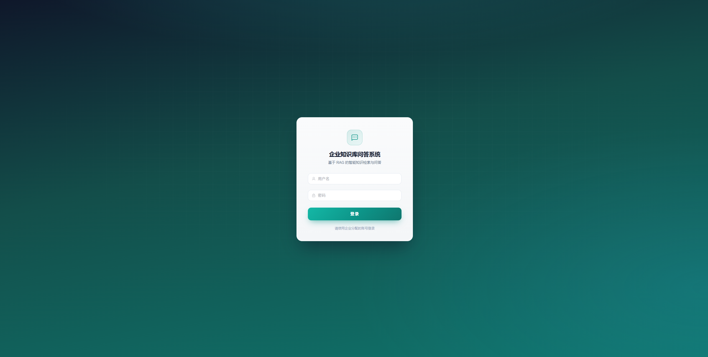
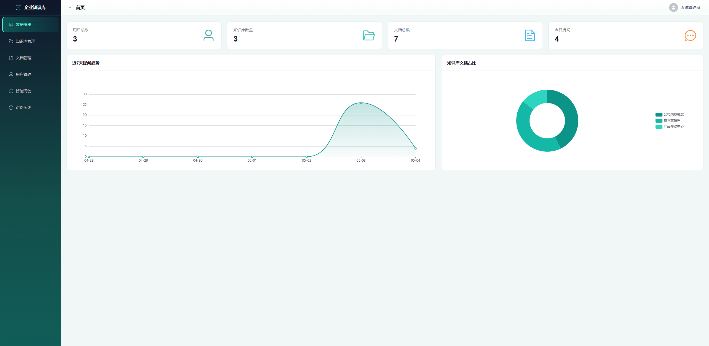

# EnterpriseQA — 企业知识库 RAG 问答系统

基于 **Vue 3 + Flask + MySQL + Chroma** 的企业内部知识库管理与智能问答。管理员可维护知识库与文档，登录用户可选择知识库进行 **RAG（检索增强生成）** 对话。


---

## 功能概览

| 模块 | 说明 |
|------|------|
| 用户与权限 | JWT 登录；角色 **admin**（管理后台、文档维护）与 **user**（问答与历史） |
| 知识库 | 创建/启用知识库；文档上传 **txt / pdf / md / docx** |
| 向量检索 | **Chroma** 持久化存储；嵌入模型 **BAAI/bge-small-zh-v1.5**（本地 HuggingFace） |
| 问答 | **LangChain** RAG；LLM 通过 OpenAI 兼容接口调用（默认 **小米 Mimo**） |
| 管理后台 | 数据统计图表（ECharts） |

---

## 技术栈

- **前端**：Vue 3、Vite、Element Plus、Pinia、Vue Router、Axios
- **后端**：Python 3、Flask、Flask-SQLAlchemy、PyJWT
- **数据库**：MySQL 8（业务数据）
- **向量库**：Chroma（目录见环境变量 `CHROMA_PERSIST_DIR`）

---

## 环境要求

- Python **3.10+**（推荐 3.11）
- Node.js **18+**
- MySQL **8.x**
- 调用 LLM 所需的 **MIMO_API_KEY**（或改为自建 OpenAI 兼容服务后配置对应变量）

**说明**：嵌入模型首次运行会从 HuggingFace 下载，耗时取决于网络；有 NVIDIA GPU 时可在 `server/services/vector_service.py` 中将 `device` 改为 `"cuda"` 以加速向量化。

---

## 快速开始

### 1. 克隆仓库

```bash
git clone https://github.com/ShelyH/EnterpriseQA.git
cd EnterpriseQA
```

### 2. 初始化 MySQL

在 MySQL 中执行初始化脚本（二选一即可）：

- `server/sql/init.sql` — 建库、建表、测试账号与示例数据
- 或 `initsql/db_enterprise_qa.sql`（若与仓库中脚本一致）

默认逻辑库名：**db_enterprise_qa**。若你的 MySQL 端口不是 **3306**，请在后端环境变量中设置 `MYSQL_PORT`（脚本注释中曾示例 3308，以实际为准）。

**MySQL 8 登录报错**：若出现 `cryptography package is required for sha256_password...`，请确保已安装依赖中的 `cryptography`（见下文 `pip install -r requirements.txt`）。

### 3. 配置后端环境变量

在运行 Flask 前设置（Windows 可用「系统环境变量」或启动前 `set` / PowerShell `$env:...`）：

| 变量 | 说明 |
|------|------|
| `MIMO_API_KEY` | **必填**，小米 Mimo OpenAI 兼容接口的 API Key |
| `MIMO_BASE_URL` | 可选，默认 `https://token-plan-cn.xiaomimimo.com/v1` |
| `MIMO_MODEL` | 可选，默认 `mimo-v2.5-pro` |
| `MIMO_MAX_TOKENS` | 可选，默认 `2048` |
| `MIMO_TEMPERATURE` | 可选，默认 `0.5` |
| `MYSQL_HOST` / `MYSQL_PORT` / `MYSQL_USER` / `MYSQL_PASSWORD` / `MYSQL_DATABASE` | 与本地 MySQL 一致 |
| `SECRET_KEY` | 生产环境务必修改为随机字符串 |
| `CHROMA_PERSIST_DIR` | 可选，Chroma 持久化目录（默认在 `server/chroma_data`） |

### 4. 安装并启动后端

```bash
cd server
python -m venv .venv
# Windows: .venv\Scripts\activate
# Linux/macOS: source .venv/bin/activate
pip install -r requirements.txt
```

若启动时报错找不到 `langchain_chroma`，请单独安装：

```bash
pip install langchain-chroma
```

启动服务（默认 `0.0.0.0:5000`）：

```bash
python app.py
```

应用启动时会尝试**预加载嵌入模型**，首次下载模型可能较慢，属正常现象。

### 5. 安装并启动前端

```bash
cd client
npm install
npm run dev
```

开发环境下 Vite 将 **`/api` 代理到 `http://127.0.0.1:5000`**（见 `client/vite.config.js`），前端访问地址一般为：**http://localhost:3000**。

生产构建：

```bash
npm run build
```

将 `dist` 部署到任意静态服务器，并确保接口域名与后端 CORS、反向代理配置一致（生产环境通常不再使用 Vite 代理，需配置真实 API 基地址）。

---

## 测试账号（来自 `server/sql/init.sql`）

| 用户名 | 密码 | 角色 |
|--------|------|------|
| `admin` | `123456` | 管理员 |
| `user1` | `123456` | 普通用户 |
| `user2` | `123456` | 普通用户 |

密码在库中为 **MD5** 存储，登录接口按明文比对后再与库中 MD5 校验。

---

## 推荐使用流程

1. 使用 **admin** 登录，在后台创建或确认知识库状态为启用。
2. 上传文档并完成向量化（状态为已向量化）。
3. 在问答页选择对应知识库，输入问题即可 RAG 回答。
4. 普通用户可查看自己的对话历史；管理员可进行用户与内容管理（以当前前端路由为准）。

---


## 目录结构（简要）

```
EnterpriseQA/
├── client/                 # Vue 3 前端
├── server/                 # Flask 后端
│   ├── app.py              # 应用入口
│   ├── config.py           # 配置（MySQL、Chroma、分块等）
│   ├── routes/             # API 蓝图
│   ├── services/           # RAG、向量、单例 app_services
│   ├── models/             # SQLAlchemy 模型
│   ├── sql/init.sql        # 数据库初始化
│   ├── chroma_data/        # Chroma 持久化（运行后生成，可配置路径）
│   └── uploads/            # 上传文件存储
├── initsql/             # 备用 SQL
└── README.md
```

---

## API 前缀

后端蓝图统一挂载在 **`/api`** 下，例如：

- 登录：`POST /api/auth/login`
- 问答：`POST /api/chat/ask`

前端 Axios `baseURL` 为 `/api`（开发环境由 Vite 代理到后端）。

---
## 重新向量化已有知识库

修改 `server/config.py` 中的 `CHUNK_SIZE` / `CHUNK_OVERLAP` 后，已有 Chroma 向量不会自动更新。此时可以使用 `server/revectorize_kb.py`，基于数据库中保存的原始文件路径重新切块并写入向量库，无需重新上传文件。

建议执行前先停止后端服务，避免上传、删除、问答等操作与向量库重建并发执行。

进入后端目录：

```bash
cd server
```

预览某个知识库会处理哪些文档，不实际修改数据：

```bash
python revectorize_kb.py --kb-id 1 --dry-run
```

重新向量化指定知识库：

```bash
python revectorize_kb.py --kb-id 1
```

重新向量化单个文档：

```bash
python revectorize_kb.py --doc-id 12
```

重新向量化全部知识库：

```bash
python revectorize_kb.py --all
```

默认只处理状态为 `vectorized` 的文档。如果需要把 `failed` / `uploading` 状态的文档也纳入处理：

```bash
python revectorize_kb.py --kb-id 1 --include-failed
```

注意：如果只是修改分块大小，一般无需删除整个 `chroma_data`；脚本会按文档 ID 删除旧向量并重新写入。若同时更换了 embedding 模型且向量维度发生变化，建议先备份并清理对应 Chroma collection 或整个 `chroma_data`，再重新向量化所有相关文档。

---

## 常见问题

1. **登录报 cryptography 相关错误**  
   执行 `pip install cryptography` 或重新 `pip install -r requirements.txt`。

2. **问答很慢**  
   首次请求需加载嵌入模型与下载权重；后续请求后端使用进程内单例复用模型与 LLM 客户端。可适当减小 `MIMO_MAX_TOKENS` 或使用 GPU 做嵌入。

3. **Chroma / 向量检索报错**  
   确认已安装 `chromadb` 与 `langchain-chroma`，且 `CHROMA_PERSIST_DIR` 对运行用户可写。

---
## 系统界面


## 许可证与致谢

具体许可证以仓库为准。本项目使用 LangChain、Chroma、HuggingFace 等开源组件；LLM 服务以你所配置的兼容接口为准。

本项目演示视频来自哔哩哔哩：[BV1HhAGzhELw](https://www.bilibili.com/video/BV1HhAGzhELw)。


